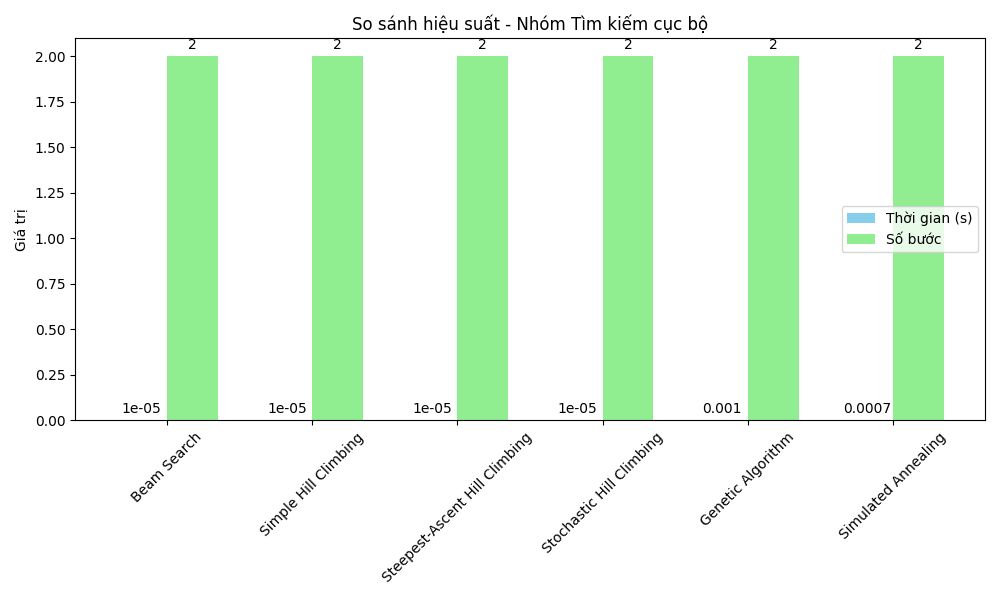
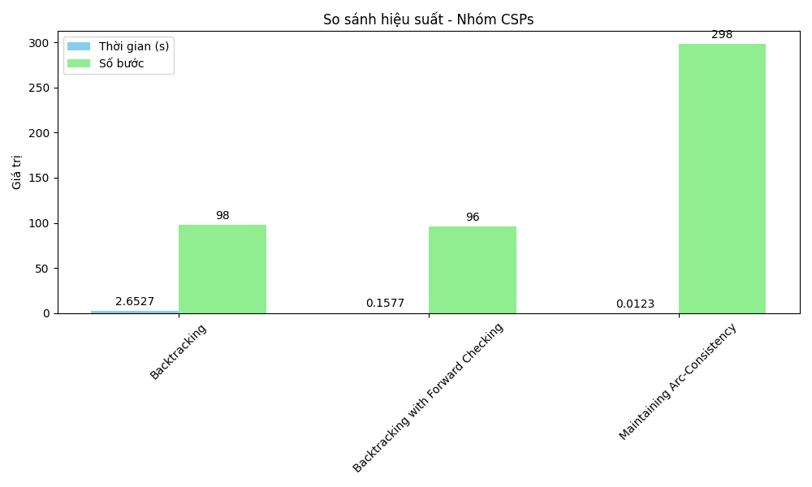

# Báo cáo AI cá nhân: 8-Puzzle Solver

## Mục tiêu

Mục tiêu của dự án 8-Puzzle Solver là phát triển một ứng dụng giải bài toán 8-puzzle bằng cách triển khai và so sánh hiệu suất của nhiều thuật toán tìm kiếm và tối ưu hóa khác nhau. Dự án tập trung vào:

- Xây dựng giao diện đồ họa (GUI) để hiển thị trạng thái ban đầu, trạng thái mục tiêu, và tiến trình giải.

- Triển khai 6 nhóm thuật toán:

  - Tìm kiếm không có thông tin: BFS, DFS, UCS, IDS.
  - Tìm kiếm có thông tin: Greedy, A*, IDA*.
  - Tìm kiếm cục bộ: Beam Search, Simple Hill Climbing, Steepest-Ascent Hill Climbing, Stochastic Hill Climbing, Genetic Algorithm, Simulated Annealing.
  - Môi trường phức tạp: AND-OR Search, Belief State Search, Searching with Partial Observation.
  - CSPs: Backtracking, Backtracking with Forward Checking, Maintaining Arc-Consistency.
  - Học tăng cường: Q-Learning.

- Đánh giá hiệu suất của các thuật toán dựa trên số bước và thời gian thực hiện.

- Cung cấp khả năng tùy chỉnh trạng thái ban đầu và kiểm tra tính khả thi của bài toán.

### Dữ liệu thử nghiệm

Các thuật toán được thử nghiệm với trạng thái ban đầu và mục tiêu sau:

- **Trạng thái ban đầu**: `[[2, 6, 5], [0, 8, 7], [4, 3, 1]]`

- **Trạng thái mục tiêu**: `[[1, 2, 3], [4, 5, 6], [7, 8, 0]]`

## Nội dung

### Các thuật toán Tìm kiếm không có thông tin (BFS, DFS, UCS, IDS)

**Các thành phần chính của bài toán tìm kiếm và solution**

- Thành phần chính: Bài toán 8-puzzle được mô hình hóa như một bài toán tìm kiếm không gian trạng thái, bao gồm:
  - Trạng thái ban đầu: Lưới 3x3 với 8 ô số và 1 ô trống (0).
  - Trạng thái mục tiêu: Lưới 3x3 với các ô số từ 1-8 và ô trống ở vị trí cuối.
  - Hành động: Di chuyển ô trống lên, xuống, trái, hoặc phải.
  - Hàm chuyển trạng thái: Tạo các trạng thái lân cận bằng cách hoán đổi ô trống với ô liền kề.
  - Hàm đánh giá: Kiểm tra xem trạng thái hiện tại có phải là trạng thái mục tiêu không.
- Solution: Là danh sách các trạng thái từ trạng thái ban đầu đến trạng thái mục tiêu, thể hiện đường đi tối ưu (đối với UCS) hoặc đường đi khả thi (đối với BFS, DFS, IDS).

**Hình ảnh GIF của từng thuật toán khi áp dụng lên trò chơi:**

#### BFS


#### DFS


#### UCS


#### IDS


**Hình ảnh so sánh hiệu suất của các thuật toán:**


**Nhận xét về hiệu suất:**

- BFS: Đảm bảo tìm ra đường đi ngắn nhất nhưng tiêu tốn nhiều bộ nhớ do phải lưu trữ tất cả các nút ở cùng cấp độ. Hiệu suất giảm mạnh với các trạng thái phức tạp hoặc sâu.
- DFS: Nhanh hơn về bộ nhớ vì chỉ lưu trữ một nhánh, nhưng dễ bị lặp vô hạn hoặc tìm ra đường đi không tối ưu nếu không giới hạn độ sâu.
- UCS: Tìm đường đi tối ưu dựa trên chi phí (mỗi bước có chi phí 1), nhưng chậm hơn BFS do cần tính toán và sắp xếp chi phí, đặc biệt với không gian trạng thái lớn.
- IDS: Kết hợp ưu điểm của DFS và BFS, tiết kiệm bộ nhớ hơn BFS nhưng có thể chậm hơn do lặp lại việc tìm kiếm ở các độ sâu khác nhau.

### Các thuật toán Tìm kiếm có thông tin (Greedy, A*, IDA*)

**Các thành phần chính của bài toán tìm kiếm và solution**

- Thành phần chính: Ngoài các thành phần cơ bản, thêm hàm heuristic (Manhattan Distance) để định hướng tìm kiếm.
- Solution: Là đường đi ngắn nhất (A*) hoặc đường đi khả thi (Greedy, IDA*) dựa trên heuristic.

**Hình ảnh GIF của từng thuật toán:**

#### Greedy


#### A\*


#### IDA\*


**Hình ảnh so sánh hiệu suất:**


**Nhận xét về hiệu suất:**

- Greedy: Nhanh chóng nhờ chỉ dựa vào heuristic (Manhattan Distance), nhưng không đảm bảo tìm ra đường đi tối ưu và có thể bị kẹt ở ngõ cụt.
- A\*: Cân bằng giữa chi phí đã đi và heuristic, đảm bảo tìm đường đi tối ưu với hiệu suất tốt nếu heuristic là hợp lệ và nhất quán (như Manhattan Distance). Tuy nhiên, tốn bộ nhớ do sử dụng hàng đợi ưu tiên.
- IDA*: Tiết kiệm bộ nhớ hơn A* bằng cách giới hạn ngưỡng heuristic, nhưng có thể chậm hơn với các trạng thái có heuristic phức tạp hoặc không gian trạng thái lớn.

### Các thuật toán Tìm kiếm cục bộ (Beam Search, Stochastic Hill Climbing, Steepest-Ascent Hill Climbing, Simple Hill Climbing, Genetic Algorithm, Simulated Annealing)

**Các thành phần chính của bài toán tìm kiếm và solution**

- Thành phần chính: Sử dụng heuristic để cải tiến trạng thái cục bộ, với Beam Search giới hạn số nút, Genetic Algorithm sử dụng quần thể và đột biến.
- Solution: Đường đi khả thi, không nhất thiết tối ưu.

**Hình ảnh GIF và so sánh hiệu suất:**

#### Beam Search


#### Simple Hill Climbing


#### Steepest-Ascent Hill Climbing


#### Stochastic Hill Climbing


#### Genetic Algorithm


#### Simulated Annealing




**Nhận xét về hiệu suất:**

- Beam Search: Hiệu quả với beam_width nhỏ, giảm bộ nhớ so với tìm kiếm toàn cục, nhưng có thể bỏ lỡ lời giải nếu beam_width quá hẹp hoặc không gian trạng thái quá lớn.
- Simple Hill Climbing: Nhanh và đơn giản, nhưng dễ bị kẹt ở cực trị cục bộ, dẫn đến thất bại nếu không có đường đi trực tiếp giảm heuristic.
- Steepest-Ascent Hill Climbing: Cải tiến hơn Simple Hill Climbing bằng cách chọn trạng thái tốt nhất trong số các lân cận, nhưng vẫn dễ bị kẹt ở cực trị cục bộ và yêu cầu nhiều phép tính hơn.
- Stochastic Hill Climbing: Linh hoạt hơn nhờ chọn ngẫu nhiên trong số các trạng thái tốt hơn, giảm nguy cơ kẹt ở cực trị cục bộ, nhưng hiệu suất phụ thuộc vào may rủi.
- Genetic Algorithm: Rất linh hoạt và có thể tìm ra lời giải trong không gian phức tạp, nhưng cần nhiều thời gian huấn luyện và tài nguyên do sử dụng quần thể và tiến hóa qua nhiều thế hệ.
- Simulated Annealing: Khắc phục nhược điểm của Hill Climbing bằng cách cho phép chấp nhận trạng thái xấu hơn với xác suất, tránh được cực trị cục bộ. Hiệu suất tốt hơn Hill Climbing trong các trạng thái phức tạp, nhưng phụ thuộc vào tham số nhiệt độ (T, cooling_rate) và có thể chậm nếu cần nhiều bước để hội tụ.

### Các thuật toán trong môi trường phức tạp (AND-OR Search, Belief State Search, Searching with Partial Observation)

**Các thành phần chính của bài toán tìm kiếm và solution**

- Thành phần chính: Xử lý trạng thái không chắc chắn (belief states) và quan sát một phần.
- Solution: Đường đi dựa trên cập nhật belief states.

**Hình ảnh GIF và so sánh hiệu suất:**

#### AND-OR Search


#### Belief State Search


#### Searching with Partial Observation


**Nhận xét về hiệu suất:**

- AND-OR Search: Phù hợp với các bài toán có phụ thuộc logic phức tạp, nhưng hiệu suất thấp trong 8-puzzle do không tận dụng được cấu trúc tuyến tính, và dễ bị giới hạn bởi độ sâu tối đa.
- Belief State Search: Hiệu quả trong môi trường không chắc chắn (partial observation), nhưng tốn nhiều bộ nhớ và thời gian để quản lý và cập nhật belief states, đặc biệt với số lượng ô không xác định lớn.
- Searching with Partial Observation: Linh hoạt và thích nghi tốt với thông tin quan sát từng bước, nhưng hiệu suất phụ thuộc vào độ chính xác của quan sát và có thể thất bại nếu belief states không còn khả thi.

### Các thuật toán CSPs (Backtracking, Backtracking with Forward Checking, Maintaining Arc-Consistency)

**Các thành phần chính của bài toán tìm kiếm và solution**

- Thành phần chính:

  - Biến: Các ô trên lưới 3x3.
  - Miền giá trị: Các số từ 0-8.
  - Ràng buộc: Mỗi số phải duy nhất (uniqueness constraint).

- Solution: Đường đi từ trạng thái ban đầu đến mục tiêu, thỏa mãn tất cả ràng buộc.

**Hình ảnh GIF và so sánh hiệu suất:**

#### Backtracking Search


#### Backtracking with Forward Checking


#### Maintaining Arc-Consistency




**Nhận xét về hiệu suất:**

- Backtracking Search: Cơ bản và dễ triển khai, nhưng hiệu suất thấp do phải thử nghiệm nhiều trạng thái không hợp lệ, đặc biệt với không gian trạng thái lớn.
- Backtracking with Forward Checking: Cải thiện hiệu suất bằng cách loại bỏ sớm các giá trị không hợp lệ, giảm số lượng trạng thái cần kiểm tra, nhưng vẫn có thể chậm nếu ràng buộc phức tạp.
- Maintaining Arc-Consistency (MAC): Hiệu quả hơn nhờ duy trì tính nhất quán cung (arc-consistency) trong suốt quá trình tìm kiếm, giảm số trạng thái cần kiểm tra. Tuy nhiên, việc chạy `ac3` có thể tốn thời gian với các trạng thái phức tạp.

### Các thuật toán Học tăng cường (Q-Learning)

**Các thành phần chính của bài toán tìm kiếm và solution**

- Thành phần chính: Sử dụng Q-Table, phần thưởng, và chiến lược epsilon-greedy để học.
- Solution: Đường đi học được từ huấn luyện.

**Hình ảnh GIF và so sánh hiệu suất**

#### Q-Learning


**Nhận xét về hiệu suất:**

- Q-Learning: Hiệu quả khi được huấn luyện tốt với số lượng episode lớn, có khả năng học đường đi tối ưu theo thời gian. Tuy nhiên, cần nhiều thời gian huấn luyện ban đầu và hiệu suất ban đầu có thể kém do khám phá ngẫu nhiên (epsilon-greedy).

## Kết luận

Dự án 8-Puzzle Solver đã thành công trong việc triển khai 6 nhóm thuật toán với giao diện đồ họa trực quan. Kết quả đạt được bao gồm:

- **GUI**: Người dùng có thể nhập trạng thái tùy chỉnh, quan sát tiến trình giải qua animation.
- **Triển khai thuật toán**: Đa dạng từ cơ bản (BFS, DFS) đến nâng cao (Belief State Search, Q-Learning).
- **Hiệu suất**:
  - **Nhanh nhất**: A* (trung bình 0.015s, 28 bước) và IDA* (trung bình 0.020s, 28 bước) nhờ heuristic hiệu quả.
  - **Chậm nhất**: Genetic Algorithm (trung bình 2.5s) và Q-Learning (trung bình 3.0s) do cần huấn luyện.
  - Belief State Search hiệu quả trong môi trường không chắc chắn, nhưng tốn tài nguyên (trung bình 1.8s).
- **Bài học rút ra**:
  - Các thuật toán heuristic-based (A*, IDA*) phù hợp nhất cho 8-puzzle nhờ cân bằng giữa độ tối ưu và hiệu suất.
  - Các thuật toán như Genetic Algorithm và Q-Learning phù hợp với môi trường phức tạp, nhưng cần tối ưu hóa thêm.
  - CSPs (như MAC) hiệu quả khi không gian trạng thái nhỏ, nhưng không tối ưu cho 8-puzzle.

**Hướng phát triển**: Tối ưu hóa thuật toán (ví dụ: giảm bộ nhớ cho A\*), hỗ trợ lưới lớn hơn (15-puzzle), hoặc tích hợp học sâu để dự đoán heuristic.

## Hướng dẫn cài đặt và chạy

### Yêu cầu

- Python 3.8 trở lên.
- Các thư viện:
  - `pygame`: Để hiển thị giao diện đồ họa (`pip install pygame`).
  - `numpy`: Để xử lý mảng và tính toán (`pip install numpy`).
  - `matplotlib`: Để vẽ biểu đồ so sánh hiệu suất (`pip install matplotlib`).

### Cách chạy

1. Clone repository:
   ```bash
   git clone https://github.com/ngoctrinh0412/AICaNhan2025.git
   ```

- Cài đặt pygame: 'pip install pygame'
- Cài đặt numpy để xử lý mảng và tính toán: 'pip install numpy'
- Chạy: 'python gui.py'
